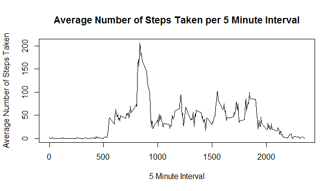
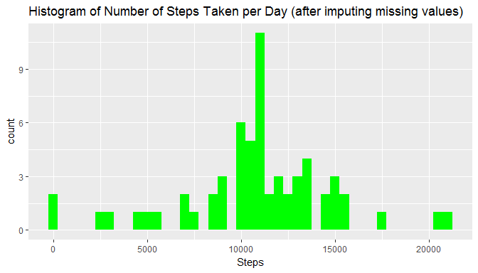
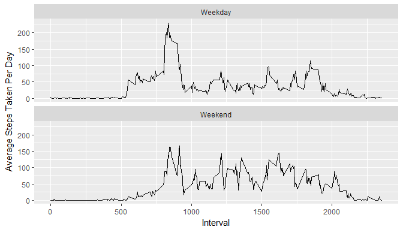

# Reproducible Research: Peer Assessment 1


## Loading and preprocessing the data


```r
library(knitr)
```

```
## Warning: package 'knitr' was built under R version 3.3.3
```

```r
opts_chunk$set(echo=TRUE)
```


```r
setwd("C:/Soumik/Datasets/activity")
activityData<-read.csv("activity.csv",header=TRUE,na.strings="NA")
```
Analysis - Total number of steps taken per day.


```r
totStepsPerDay<-aggregate(steps~date,activityData,sum)
```
Histogram of the total number of steps taken each day -

```r
library(ggplot2)
```

```
## Warning: package 'ggplot2' was built under R version 3.3.3
```

```r
qplot(totStepsPerDay$steps,geom="histogram",binwidth=500,main="Histogram of Number of Steps Taken per Day",xlab = "Steps",fill=I("blue"))
```

<!-- -->


## What is mean total number of steps taken per day?


```r
print(paste("Mean total number of steps taken per day =",mean(totStepsPerDay$steps)))
```

```
## [1] "Mean total number of steps taken per day = 10766.1886792453"
```


```r
print(paste("Median total number of steps taken per day =",median(totStepsPerDay$steps)))
```

```
## [1] "Median total number of steps taken per day = 10765"
```

## What is the average daily activity pattern?

A time series plot of the 5-minute interval (x-axis) and the average number of steps taken, averaged across all days (y-axis) is shown below:


```r
avgSteps5MinInterval<-aggregate(steps~interval,activityData,mean)
plot(avgSteps5MinInterval$interval,avgSteps5MinInterval$steps,type="l",main="Average Number of Steps Taken per 5 Minute Interval",xlab="5 Minute Interval",ylab="Average Number of Steps Taken")
```

<!-- -->


5-Minute interval that contains maximun number of steps:

```r
avgSteps5MinInterval[which.max(avgSteps5MinInterval$steps),]
```

```
##     interval    steps
## 104      835 206.1698
```

## Imputing missing values

total number of missing values in the dataset (i.e. the total number of rows with NAs):


```r
totalMissingValues<-sum(is.na(activityData))
totalMissingValues
```

```
## [1] 2304
```

Following strategy has been used for filling in all of the missing values in the dataset

* The missing value has been imputed by the mean of the corresponding 5-minute interval
* A new dataset is created after imputing the missing values


```r
activityDataImputed<-activityData

for (i in 1:nrow(activityDataImputed))
{
  if(is.na(activityDataImputed$steps[i]))
  {
    missingValue<-avgSteps5MinInterval$steps[avgSteps5MinInterval$interval==activityDataImputed$interval[i]]
    activityDataImputed$steps[i]<-missingValue
  }
}
```

After imputing, the following histogram shows the total number of steps taken each day:


```r
totStepsPerDay.new<-aggregate(steps~date,activityDataImputed,sum)
```

```r
qplot(totStepsPerDay.new$steps,geom="histogram",binwidth=500,
      main="Histogram of Number of Steps Taken per Day (after imputing missing values)",xlab = "Steps",
      fill=I("green"))
```

<!-- -->

Following are the mean and median total number of steps taken per day after imputing:

```r
print(paste("Mean:",mean(totStepsPerDay.new$steps)))
```

```
## [1] "Mean: 10766.1886792453"
```

```r
print(paste("Median:",median(totStepsPerDay.new$steps)))
```

```
## [1] "Median: 10766.1886792453"
```

Observations on Mean and Median:

* After imputing, the mean and median are same
* Imputation didn't affect the mean, but the median is different.


## Are there differences in activity patterns between weekdays and weekends?

Create a new factor variable in the dataset with two levels - "weekday" and "weekend" indicating whether a given date is a weekday or weekend day.


```r
activityDataImputed$date<-as.Date(activityDataImputed$date,"%Y-%m-%d")
for(k in 1:nrow(activityDataImputed))
{
  if((weekdays(activityDataImputed$date[k])=="Sunday") | (weekdays(activityDataImputed$date[k])=="Saturday"))
  {
    activityDataImputed$typeofDay[k]<-"Weekend"
  }
  else activityDataImputed$typeofDay[k]<-"Weekday"
}
```

Following is a panel plot containing a time series plot of the 5-minute interval (x-axis) and the average number of steps taken, averaged across all weekday days or weekend days (y-axis)-


```r
activityDataImputed<-activityDataImputed[,c(4,3,1)]
agg.activityDataImputed<-aggregate(steps~(typeofDay+interval),activityDataImputed,mean)
```

```r
qplot(interval,steps,
      data=agg.activityDataImputed,
      geom = "line",ylab="Average Steps Taken Per Day",xlab="Interval")+ facet_wrap(~typeofDay,ncol = 1)
```

<!-- -->


## End of Analysis
